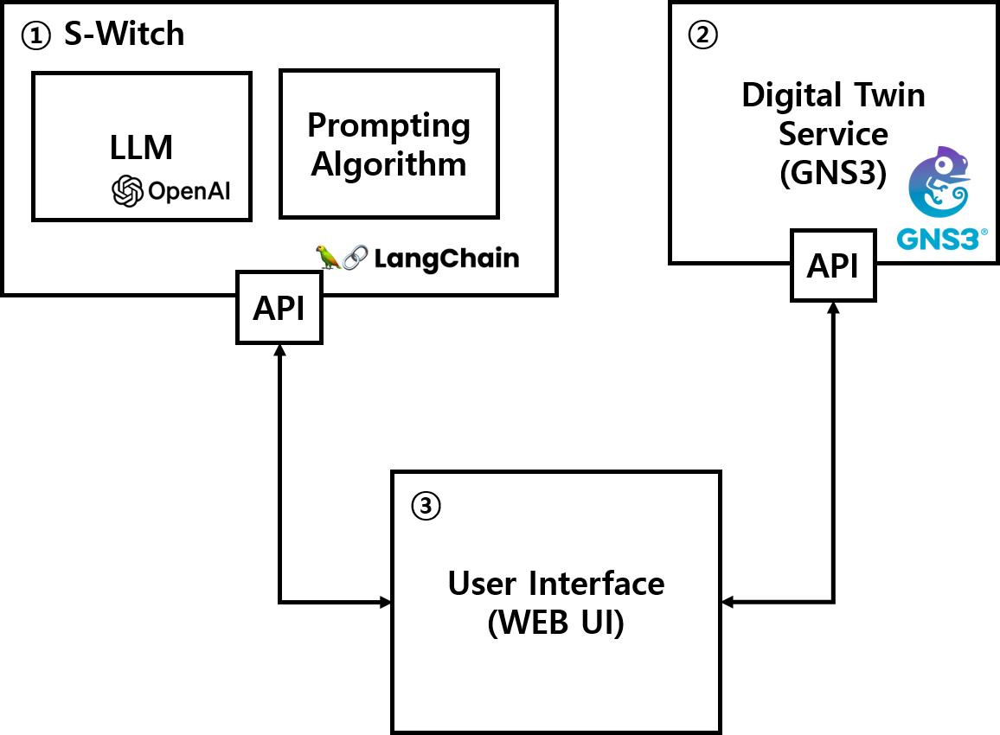
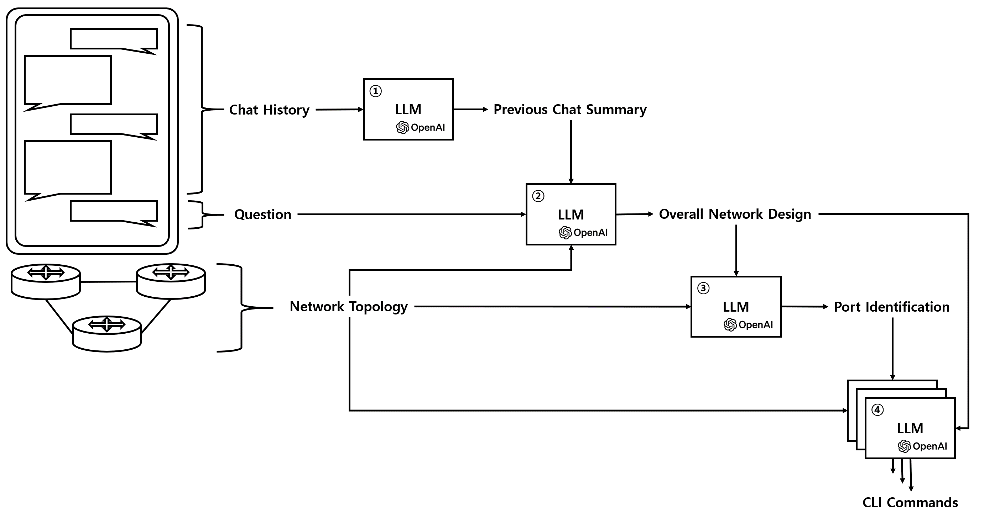
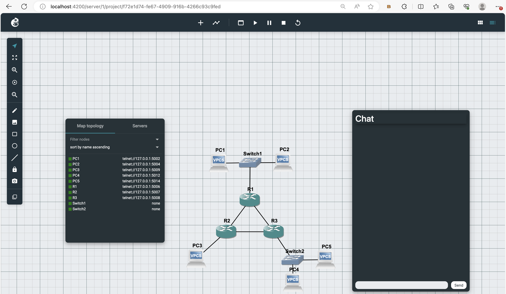

# S-Witch (Switch Witch) : Switch Configuration Assistant

  
  
  
  
  
  

In modern network structures that become more complex and emphasize flexibility, the demand for the automation of network management and Intent Driven Network continues to increase. In response, technology utilizing virtualization and control plane separation has developed, and research on network automation based on this is being actively conducted. However, limited studies focus on building an automated network in environments comprised of traditional switches that lack support for these advanced functionalities. Consequently, this study presents a technology proposal that creates the CLI command for existing commercial switches by incorporating user requests conveyed through natural language. For this purpose, we applied LLM for generating and Network Digital Twin for verification environment.

## Architecture

### Overall Architecture

Our system consists of 3 components: S-Witch, Digital Twin, and Web UI.

  

### Chaining Architecture

Our connection strategy is as follows.

  

## Result

### Web View (Chatting)

  

